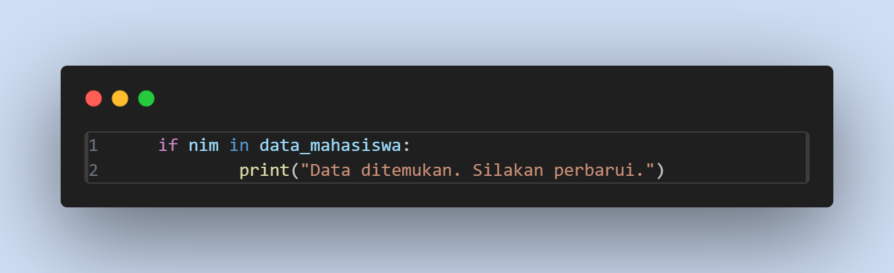

# praktikum6

## Fungsi hitung_nilai_akhir

-Mendifinisikan Fungsi bernama hitung_nilai_akhir yang menerima tiga parameter: tugas, uts, dan uas.

-Menghitung nilai akhir berdasarkan bobot yang telah ditentukan: tugas 30%, UTS 35%, dan UAS 35%. Hasil perhitungan dikembalikan (return).

## Fungsi tampilkan_data

-Mendefinisikan fungsi tampilkan_data untuk menampilkan semua data mahasiswa.

-Mengecek apakah dictionary data_mahasiswa kosong. Jika kosong, cetak pesan "Daftar Nilai Mahasiswa Kosong" dan keluar dari fungsi.

-Mencetak judul tabel dan garis pemisah sepanjang 86 karakter.

-Mencetak header kolom tabel dengan lebar kolom yang telah diatur agar rapi. Simbol ^ menandakan bahwa teks akan diratakan ke tengah.

-Mencetak data mahasiswa untuk setiap baris, termasuk nomor urut (i), NIM, nama, nilai tugas, UTS, UAS, dan nilai akhir. Nilai akhir diformat menjadi dua angka desimal (.2f).

-Mencetak garis pemisah di akhir tabel.

## Inisialisasi data_mahasiswa

-Membuat dictionary kosong data_mahasiswa untuk menyimpan data mahasiswa.

-Mencetak menu opsi dan meminta input dari pengguna. Input kemudian diubah menjadi huruf kecil (lower()) agar bisa diterima dalam bentuk huruf besar atau kecil.

# Tambah data

-Jika pengguna memilih opsi 'T', program meminta input NIM dari pengguna.

-Mengecek apakah NIM yang dimasukkan sudah ada di data_mahasiswa. Jika ya, tampilkan pesan bahwa NIM sudah terdaftar dan lanjutkan ke iterasi berikutnya dari loop (continue).

-Meminta input nama, nilai tugas, UTS, dan UAS. Nilai tugas, UTS, dan UAS dikonversi menjadi tipe data float karena mereka adalah angka desimal.

-Menyimpan data mahasiswa ke dalam dictionary data_mahasiswa dengan NIM sebagai kunci dan informasi lainnya sebagai nilai.

-Menampilkan pesan konfirmasi bahwa data berhasil ditambahkan.

# Ubah data

-Jika pengguna memilih opsi 'U', program meminta input NIM mahasiswa yang datanya ingin diubah.

-Mengecek apakah NIM tersebut ada dalam data_mahasiswa. Jika ada, tampilkan pesan bahwa data ditemukan dan meminta input data baru.

-Menghitung nilai akhir baru dan memperbarui data mahasiswa di dictionary data_mahasiswa.

-Menampilkan pesan konfirmasi bahwa data berhasil diperbarui.

# Hapus data

-Jika pengguna memilih opsi 'H', program meminta input NIM mahasiswa yang datanya ingin dihapus.

-Mengecek apakah NIM tersebut ada dalam data_mahasiswa. Jika ada, data dihapus menggunakan perintah del dan menampilkan pesan konfirmasi.

# Lihat data

-Jika pengguna memilih opsi 'L', program memanggil fungsi tampilkan_data untuk menampilkan seluruh data mahasiswa.

# Cari data

-Jika pengguna memilih opsi 'C', program meminta input NIM mahasiswa yang ingin dicari.

-Mengecek apakah NIM tersebut ada dalam data_mahasiswa. Jika ada, data mahasiswa tersebut disimpan dalam variabel mahasiswa.

-Mencetak data mahasiswa tersebut dengan format tabel yang rapi, serupa dengan fungsi tampilkan_data.

# Keluar program

Jika pengguna memilih opsi 'K', program mencetak pesan perpisahan dan menghentikan loop dengan break, sehingga program berhenti.

# Pilihan tidak valid

Jika input dari pengguna tidak cocok dengan salah satu opsi yang tersedia, tampilkan pesan kesalahan dan program kembali ke menu.

# Hasil

